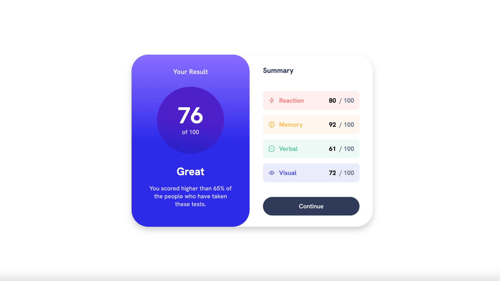

# Results summary component

This is my solution to the [Results summary component challenge on Frontend Mentor](https://www.frontendmentor.io/challenges/results-summary-component-CE_K6s0maV).

## Overview

I completed this challenge by using Vanilla JavaScript and SCSS with no external libraries or frameworks, all for good practice.

### The challenge

Users should be able to:

- View the optimal layout for the interface depending on their device's screen size
- See hover and focus states for all interactive elements on the page

### Screenshot Preview

### Demo

- Live Site URL: [https://summary.adamrichardturner.dev/](https://summary.adamrichardturner.dev/)

### Built with

- Semantic HTML5 markup
- Sass (SCSS)
- Flexbox
- CSS Grid
- Vanilla JavaScript
